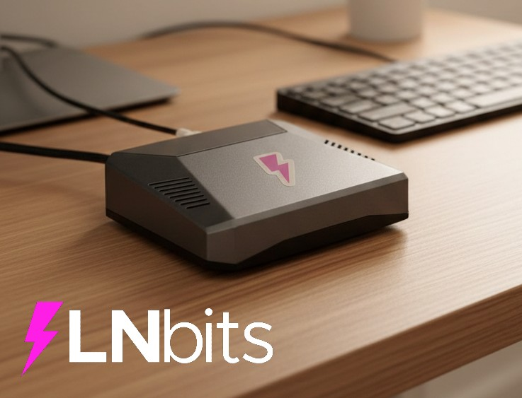

# LNbitsBox

A pre-configured, bootable NixOS SD card image for Raspberry Pi 4 that runs [LNbits](https://github.com/lnbits/lnbits) with Lightspark Spark as a funding source.



## What's included

- **NixOS** 
- **LNbits**
- **Lightspark Spark** for interacting with the Lightning Network
- **First-run configuration wizard** for easy setup
- **Wi-Fi support** via simple `wifi.txt` file on the SD card (no monitor needed)
- **SSH enabled** for remote access
- **Tor hidden service** for private remote access (`.onion` address, no port forwarding needed)

### SD Card Partition Layout

After flashing, your SD card will have two partitions:

1. **FIRMWARE** (FAT32, ~100MB) - Boot partition with Raspberry Pi firmware, kernel, and config.txt
2. **NIXOS_SD** (ext4, remaining space) - Root filesystem with the full NixOS system

### Directory Structure

Once configured, the system uses the following directories:

- **`/var/lib/lnbits`** - LNbits data directory (database etc.)
- **`/var/lib/lnbits-extensions`** - Extensions directory
- **`/var/lib/spark-sidecar`** - Spark wallet data and mnemonic
- **`/var/lib/caddy`** - Caddy web server data (config, logs etc)
- **`/var/lib/tor/onion/lnbits`** - Tor hidden service keys and hostname
- **`/etc/lnbits/lnbits.env`** - LNbits configuration file

All directories are owned by their respective system users and persist across reboots.

## Quick start: Download and flash

### Step 1: Download the image

1. Go to **[Releases](../../releases)**
2. Download the latest `nixos-sd-image-*-aarch64-linux.img.zst` file
3. (Optional) Download `SHA256SUMS.txt` to verify integrity

### Step 2: Flash to SD card

Choose your preferred method based on your operating system:

#### **Method 1: Raspberry Pi Imager (Easiest - All Platforms)**

**Recommended for most users** - Works on Windows, macOS, and Linux.

1. Download and install [Raspberry Pi Imager](https://www.raspberrypi.com/software/)
2. Insert your SD card (16GB minimum recommended)
3. Open Raspberry Pi Imager
4. Click **"Choose OS"** → Scroll down → **"Use custom"**
5. Select your downloaded `*.img.zst` file (no need to decompress!)
6. Click **"Choose Storage"** and select your SD card
7. Click **"Write"** and wait for completion

✅ Raspberry Pi Imager automatically decompresses `.zst` files!

#### **Method 2: Command Line (Advanced Users)**

**Linux:**
```bash
# Find your SD card device (look for /dev/sdX)
lsblk

# Unmount the SD card (replace sdX with your device)
sudo umount /dev/sdX*

# Decompress first, then write
zstd -d nixos-sd-image-*.img.zst
sudo dd if=nixos-sd-image-*.img of=/dev/sdX bs=4M status=progress conv=fsync
```

**macOS:**
```bash
# Find your SD card device (look for /dev/diskX)
diskutil list

# Unmount the SD card (replace diskX with your device)
diskutil unmountDisk /dev/diskX

# Write the image (use rdiskX for faster writing)
zstd -dc nixos-sd-image-*.img.zst | sudo dd of=/dev/rdiskX bs=4m

# Eject when complete
diskutil eject /dev/diskX
```

### Step 3: Set up Wi-Fi (optional)

If you want to use Wi-Fi instead of (or in addition to) ethernet, configure it before the first boot:

1. After flashing, remove and re-insert the SD card
2. Open the **LNbitsBox** partition (FAT32 firmware partition) in your file explorer
3. You'll see a file called `wifi.txt.example` — rename it to `wifi.txt`
4. Edit `wifi.txt` with your Wi-Fi details:

```
SSID=YourNetworkName
PASSWORD=YourWiFiPassword
```

Optional settings:
```
# Two-letter country code for regulatory compliance (e.g., US, GB, DE)
COUNTRY=US

# Set to true if your network doesn't broadcast its name
HIDDEN=true
```

5. Save the file and eject the SD card

On first boot, LNbitsBox will automatically connect to your Wi-Fi network. The plaintext password is removed from `wifi.txt` after it's been read for security.

> **Note:** You can use both ethernet and Wi-Fi at the same time. If ethernet is connected, the system will work on both interfaces.

### Step 4: First boot

1. Insert the SD card into your Raspberry Pi 4
2. Connect ethernet cable (skip if you configured Wi-Fi in Step 3)
3. Power on the Pi
4. **If you have a monitor connected:**
   - You'll see boot messages and a login prompt
   - The system displays a welcome message with setup instructions
5. Wait 2-3 minutes for first boot to complete
6. Find the Pi's IP address:
   - Check your router's DHCP client list for hostname `lnbits`
   - Try connecting via mDNS: `ssh lnbitsadmin@lnbits.local`
   - Use a network scanner like `nmap` or `angry-ip-scanner`
   - Or check the login screen if you have a monitor connected

### Step 5: Complete the setup wizard

On first boot, LNbitsBox presents a configuration wizard at `https://<pi-ip-address>/` or `https://lnbits.local/` to guide you through the initial setup.

**Open your browser:**
`https://<pi-ip-address>/` or `https://lnbits.local/`

**Follow the wizard steps:**

1. **Generate or import Spark wallet seed**
   - Click "Generate New Seed Phrase" for a new 12-word BIP39 mnemonic
   - OR paste an existing seed phrase to import
   - ⚠️ **CRITICAL:** Write down your seed phrase and store it safely
   - You will only see it once during this setup
   - Check the box confirming you've saved it

2. **Set SSH password**
   - Create a password for the `lnbitsadmin` user
   - Minimum 8 characters
   - You'll use this to SSH into your Pi

3. **Complete setup**
   - The wizard will configure your system
   - Wait 10-15 seconds for services to start
   - LNbits will open automatically

### Step 6: Access LNbits

After completing the wizard, LNbits is available at the same URL:

`http://<pi-ip-address>/` or `http://lnbits.local/`

**SSH access:**
```bash
ssh lnbitsadmin@<pi-ip-address>
# Use the password you set in the wizard
```

**Tor access (remote/private):**

LNbits is also available as a Tor hidden service. The `.onion` address is generated automatically on first boot (takes 1-2 minutes). You can find it:
- In the admin dashboard at `https://<pi-ip-address>/box/` (shown in the Tor Address card)
- Via SSH: `cat /var/lib/tor/onion/lnbits/hostname`

To access LNbits over Tor, open the `.onion` URL in [Tor Browser](https://www.torproject.org/download/). This works from anywhere without port forwarding.

That's it! Your LNbits node with Spark L2 Lightning is now running.

## Resetting the configuration

If you need to re-run the setup wizard (for example, if you skipped saving the seed phrase):

**SSH into your Pi:**
```bash
ssh lnbitsadmin@<pi-ip-address>
```

**Run the reset command:**
```bash
sudo lnbitspi-reset
```

This will:
- Stop LNbits and Spark sidecar services
- Remove the configuration marker
- Optionally delete the Spark mnemonic (you'll be prompted)
- Optionally reset Wi-Fi configuration (you'll be prompted)
- Re-enable the setup wizard

After reset, the wizard will be available again at `http://<pi-ip-address>/`

⚠️ **Note:** This does NOT delete your LNbits database or user data.

## Troubleshooting

### Flashing Issues

**"Not enough space" error:**
- Ensure your SD card is at least 8GB (16GB+ recommended)
- Some SD cards report less usable space than advertised

**Image won't decompress:**
- **Windows:** Install [7-Zip](https://www.7-zip.org/) or [PeaZip](https://peazip.github.io/)
- **macOS:** Install zstd: `brew install zstd`
- **Linux:** Install zstd: `sudo apt install zstd` or `sudo yum install zstd`

**"Permission denied" when flashing:**
- Linux/macOS: Use `sudo` with dd commands
- Windows: Run as Administrator
- Make sure the SD card is not mounted/in use

**Flashing fails or SD card not detected:**
- Try a different SD card (some old/cheap cards have compatibility issues)
- Use a different SD card reader
- Check if the SD card is write-protected (physical switch on some cards)

### Boot Issues

**Screen goes black after boot messages:**
- **By default, this is expected behavior** - the system is configured for SSH access only
- After showing "Reached target multi-user system", the display goes blank
- The system is running fine and waiting for SSH connections
- To verify: Check your router for the Pi's IP address or try `ssh lnbitsadmin@lnbits-pi4.local`
- **To enable console login on HDMI**, the configuration needs these kernel parameters in `nixos/configuration.nix`:
  ```nix
  boot.kernelParams = [
    "consoleblank=0"
    "console=tty1"  # Force console to HDMI (otherwise it goes to serial UART)
  ];
  systemd.services."getty@tty1".enable = true;
  ```
  The latest version already has these enabled. If using an older image, rebuild and reflash with the latest code.

**Pi won't boot / No activity at all:**
- Verify the image was written completely (check file sizes)
- Try re-flashing the image
- Ensure you're using a Raspberry Pi 4 (this image won't work on Pi 3 or earlier)
- Check your power supply (Pi 4 needs a good 5V/3A USB-C supply)
- Look for the green activity LED - it should blink during boot

**Boot messages stop or system hangs before "multi-user system":**
- This indicates an actual boot problem (different from black screen above)
- Connect via serial console (UART pins) to see detailed logs
- Check if you modified any critical system settings
- Try reflashing with the official unmodified image first

**Can't find the Pi's IP address:**
- Wait 3-5 minutes for first boot (it takes longer than subsequent boots)
- Check your router's connected devices list
- Connect a monitor and keyboard to see boot messages and login directly
- Try connecting via ethernet instead of WiFi (WiFi needs additional configuration)

**Can't SSH into the Pi:**
- Make sure you're on the same network
- Try `ssh -v lnbitsadmin@<ip>` for verbose debugging
- Check if port 22 is open: `nmap -p 22 <ip>`
- Wait a bit longer - first boot takes time

**Can't access web interface (wizard or LNbits):**
- Verify nginx is running: `ssh` into the Pi and run `systemctl status nginx`
- Check if port 80 is open: `nmap -p 80 <ip>`
- Try accessing from a different device on the same network
- Check firewall rules: `sudo iptables -L -n | grep 80`
- If configured, check LNbits is running: `systemctl status lnbits`
- If not configured, check configurator is running: `systemctl status lnbitspi-configurator`

**Wizard doesn't appear on first boot:**
- Wait a few minutes for the configurator service to start
- Check if configurator is running: `ssh` into Pi and run `systemctl status lnbitspi-configurator`
- Check nginx is routing correctly: `curl -I http://localhost/`
- If already configured, the marker file exists: `ls /var/lib/lnbits/.configured`
- To re-run wizard, use: `sudo lnbitspi-reset`

**Can't set SSH password in wizard:**
- Ensure you're entering at least 8 characters
- Check passwords match exactly
- If it fails, check logs: `journalctl -u lnbitspi-configurator`

**Services don't start after wizard:**
- Wait 10-15 seconds for services to start
- Check spark-sidecar: `systemctl status spark-sidecar`
- Check lnbits: `systemctl status lnbits`
- Check logs: `journalctl -u spark-sidecar` and `journalctl -u lnbits`
- Verify marker file exists: `ls /var/lib/lnbits/.configured`

**Forgot to save seed phrase:**
- Run `sudo lnbitspi-reset` to restart the wizard
- Choose NOT to delete the mnemonic when prompted
- In the wizard, import your existing mnemonic instead of generating new

**Tor hidden service not working / no `.onion` address:**
- Tor takes 1-2 minutes to establish the hidden service on first boot
- Check Tor is running: `systemctl status tor`
- Check Tor logs: `journalctl -u tor`
- Verify the hostname file exists: `sudo cat /var/lib/tor/onion/lnbits/hostname`
- The `.onion` address persists across reboots once generated

**Wi-Fi not connecting:**
- Verify `wifi.txt` was renamed correctly (not `wifi.txt.txt` on Windows — enable "show file extensions")
- Check that SSID and password are correct (no extra spaces around `=`)
- Check Wi-Fi service status: `systemctl status wifi-config` and `systemctl status wpa_supplicant`
- View Wi-Fi logs: `journalctl -u wifi-config` and `journalctl -u wpa_supplicant`
- If credentials were wrong, reset Wi-Fi with `sudo lnbitspi-reset`, place a corrected `wifi.txt` on the firmware partition, and reboot. This will restart the wizard so make sure you have your Spark seed phrase saved before doing this!
- Ensure your Pi 4 is within range of your Wi-Fi router
- Some 5GHz-only networks may not work — try a 2.4GHz network

**LNbits can't connect to Spark sidecar:**
- Check Spark is running: `systemctl status spark-sidecar`
- Check Spark logs: `journalctl -u spark-sidecar`
- Verify mnemonic file exists: `sudo ls -l /var/lib/spark-sidecar/mnemonic`
- Check LNbits config has Spark URL: `cat /etc/lnbits/lnbits.env | grep SPARK`

## Development
Find development instructions in [docs/development.md](docs/development.md)

## License

This project configuration is provided as-is for educational and deployment purposes. LNbits itself is licensed under the MIT License.


